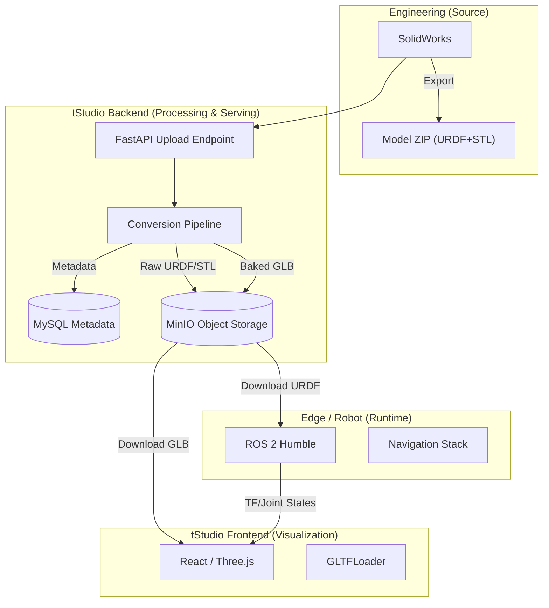

# 植树机器人全栈数字孪生与可视化技术方案 V1.0.1

本文档详细描述了植树机器人项目从建模源头到 Web 端调度的全链路数据流与可视化技术实现方案。本方案旨在解决工程模型（URDF/STL）与 Web 展示模型（GLB）之间的格式鸿沟，构建自动化、轻量化且高保真的数字孪生平台。

## 1. 总体架构设计

### 1.1 架构决策分析 (Architecture Decision Record)

在确定本方案之前，我们深度对比了三种主流的可视化技术路径。基于“植树机器人调度系统”的商业场景与用户画像（操作员而非研发人员），我们做出了以下决策。

| 维度 | 方案一：复刻 RViz（Web 版） | 方案二：云渲染（Pixel Streaming） | 方案三：GLB 烘焙方案（本方案） |
| --- | --- | --- | --- |
| 技术原理 | 前端解析 URDF + 下载 50+ STL 文件 | 服务器运行 RViz + 推送视频流 | 后端预处理生成 1 个 GLB 文件 |
| 网络开销 | 极高（Request Storm，50+ HTTP 连接） | 极高（视频带宽消耗） | 极低（1 次请求，~5MB 压缩数据） |
| 加载体验 | 零件逐个加载，像“拼图”一样卡顿 | 依赖网速，可能模糊或延迟 | 瞬间完整加载，丝般顺滑 |
| 适用场景 | 研发调试（需动态修改关节参数） | 高保真仿真 / 游戏 | 生产调度 / 监控大屏 |
| 决策结论 | ❌ 不推荐（体验差，难以 CDN 加速） | ❌ 不推荐（服务器成本过高） | ✅ 强烈推荐（工业互联网标准做法） |

> 决策核心：调度系统的核心用户不关心 URDF 结构，只关心“机器人在哪里”。因此，我们拒绝在前端进行繁重的 XML 解析与几何组装，而是将复杂度转移至后端，通过 GLB 交付极致的 Web 体验。

### 1.2 设计目标

- 单一数据源 (Single Source of Truth)：坚持以 SolidWorks 导出的工程文件为源头，避免手动维护多套模型。
- 端到端自动化：实现从“工程师上传”到“Web 端展示”的全自动转换，无需人工干预几何转换或材质修复。
- 高性能展示：Web 端加载时间 < 2 秒，支持 30fps+ 流畅渲染。
- 云原生部署：适配 K8s/Docker 环境，支持 MinIO 对象存储，符合 12-Factor App 原则。

### 1.3 系统拓扑



---

[图片]


## 2. 数据流与资产管线 (Asset Pipeline)

### 2.1 格式选型标准

| 场景 | 文件格式 | 包含信息 | 优势 | 用途 |
| --- | --- | --- | --- | --- |
| 源文件 | .SLDASM | 参数化实体 | 工程师编辑 | 设计修改 |
| 物理/仿真 | .URDF + .STL | 运动学 + 几何（无色） | ROS 2 原生支持，计算碰撞快 | Gazebo 仿真、RViz2 调试、碰撞检测 |
| Web 展示 | .GLB | 几何 + 颜色/材质 + 压缩 | 体积极小（STL 的 1/10），GPU 加载快 | 调度系统监控、数字孪生回放 |

### 2.2 自动化转换流程 (Backend Logic)

当工程师在 tStudio 后台上传 ZIP 包时，后端触发以下处理管线：

1. 解压与校验：
   - 解压 ZIP，验证是否包含 robot.urdf 及 /meshes 目录。
   - 安全检查：防止 Zip Slip 路径遍历攻击。

2. URDF 解析与颜色提取：
   - 解析 URDF XML，提取 `<material>` 标签定义的颜色值。
   - 建立映射表：`{'link_name': {'mesh': 'base.stl', 'color': [255, 100, 0, 255]}}`。

3. 几何烘焙 (Baking)：
   - 核心步骤：利用 `trimesh` 库加载 STL 网格。
   - 材质注入：将 URDF 中定义的颜色“烘焙”到网格顶点或面颜色中（解决 STL 无色问题）。
   - 压缩导出：将处理后的网格导出为 `.glb` 格式（二进制压缩，Draco 压缩可选）。

4. 双路分发存储：
   - 路径 A (Raw for ROS)：上传原始 URDF/STL 到 MinIO `ros-assets` 桶。
   - 路径 B (Web for Vis)：上传生成的 GLB 到 MinIO `web-assets` 桶。


---

## 3. 存储与数据库设计

### 3.1 存储策略

- 对象存储 (MinIO)：所有模型文件（URDF、STL、GLB）均存储在 MinIO，严禁存储在后端本地文件系统或代码仓库中。
- 数据库 (MySQL)：仅存储元数据（版本号、上传时间、MinIO 访问 URL）。

### 3.2 目录结构规划 (MinIO)

```text
bucket: tree-robot-assets
├── v1.0.0/
│   ├── raw/                <-- 原始文件 (给 ROS 用)
│   │   ├── robot.urdf
│   │   └── meshes/
│   │       ├── base.stl
│   │       └── arm.stl
│   └── web/                <-- 处理后的文件 (给 Web 用)
│       ├── robot.glb       (整机或分体 GLB)
│       └── preview.jpg
└── v1.1.0/
    └── ...
```

### 3.3 数据库设计 (ORM: SQLModel)
本项目采用 **SQLModel** (FastAPI 官方推荐) 作为 ORM 框架，结合了 SQLAlchemy 的强大功能与 Pydantic 的简洁定义。

```python
from typing import Optional
from sqlmodel import Field, SQLModel
from datetime import datetime

class RobotModel(SQLModel, table=True):
    """
    机器人模型元数据表
    存储 GLB/URDF 的版本信息与访问路径
    """
    id: Optional[int] = Field(default=None, primary_key=True)
    version: str = Field(index=True, unique=True, description="版本号，如 v1.0.0")
    robot_type: str = Field(default="tree_planter", description="机器人类型")
    
    # 资源路径 (MinIO URL)
    urdf_url: str = Field(description="ROS使用的原始URDF路径")
    display_model_url: Optional[str] = Field(default=None, description="Web展示用的GLB路径")
    
    # 状态管理
    is_active: bool = Field(default=False, description="是否为当前生效版本")
    created_at: datetime = Field(default_factory=datetime.utcnow)
    
    # 预留字段：未来扩展 L3 控制孪生
    # kinematics_hash: str = Field(description="运动学参数哈希，用于校验前后端一致性")
```

#### 为什么选择 SQLModel?
1.  **FastAPI 原生契合**: 直接复用 Pydantic 的验证逻辑，Model 既是数据库表定义，又是 API 响应 Schema (DTO)，减少代码重复。
2.  **异步支持**: 完美适配当前的 `async/await` 架构，非阻塞读写元数据。
3.  **开发效率**: 相比原生 SQLAlchemy，代码量减少 50% 以上，特别适合数字孪生这种元数据密集型的场景。

### 3.4 MinIO 部署与后端集成（子方案）

本小节融合自《植树机器人调度系统 MinIO 对象存储技术方案 (V1.0.0)》，补充 MinIO 的部署、排障与后端集成要点。

#### 3.4.1 技术选型理由

在植树机器人调度系统中，MinIO 将承载核心的 **非结构化数据** 存储中心角色，主要存储对象包括：

1.  **3D 数字孪生资产**：`.glb` (Web 展示模型)、`.stl` (物理仿真模型)、`.urdf` (机器人描述文件)。
2.  **视觉监控数据**：机器人回传的实时作业照片、延时摄影视频（用于生长监控）。
3.  **运维数据**：机器人系统日志 (`.log.gz`)、OTA 升级固件包。

#### 3.4.2 MinIO 容器化部署方案

采用 Docker 部署，确保环境隔离与快速迁移。

生产级启动命令（示例）：

```bash
docker run -p 9000:9000 -p 9001:9001 \
  --name minio \
  -d --restart=always \
  -e "MINIO_ROOT_USER=admin" \
  -e "MINIO_ROOT_PASSWORD=<请使用强密码并通过环境变量注入>" \
  -v /mnt/data/minio_data:/data \
  -v /mnt/config/minio_config:/root/.minio \
  minio/minio server /data --console-address ":9001"
```

访问 `http://<服务器IP>:9001` 登录控制台，若能看到 Dashboard，即部署成功。

常见问题排查（摘要）：

- 登录提示 invalid login：
  - 若数据目录或配置目录残留旧配置，MinIO 可能忽略新环境变量。
  - 可查看容器日志确认当前生效配置。

#### 3.4.3 FastAPI 后端集成要点

后端采用 Python (FastAPI) 与 MinIO 交互，处理模型转换后的上传及前端的下载请求。

配置管理（示例）：

```python
from pydantic_settings import BaseSettings

class Settings(BaseSettings):
    MINIO_ENDPOINT: str = "127.0.0.1:9000"
    MINIO_ACCESS_KEY: str = "admin"
    MINIO_SECRET_KEY: str = "<通过环境变量注入>"
    MINIO_BUCKET_NAME: str = "tree-robot-assets"
    MINIO_SECURE: bool = False

    class Config:
        env_file = ".env"

settings = Settings()
```

集成约束：

- MinIO SDK 通常为同步调用，异步 Web 框架中需要放入线程池执行，避免阻塞事件循环。
- 推荐封装统一存储适配器，便于未来切换至 OSS/S3 等兼容存储。


---

## 4. 关键代码逻辑实现

### 4.1 FastAPI 上传接口 (Python)

```python
from fastapi import UploadFile, BackgroundTasks
import shutil

@app.post("/api/model/upload")
async def upload_robot_model(
    file: UploadFile, 
    version: str, 
    background_tasks: BackgroundTasks
):
    # 1. 临时保存上传的 ZIP
    temp_path = f"/tmp/{file.filename}"
    with open(temp_path, "wb") as buffer:
        shutil.copyfileobj(file.file, buffer)
        
    # 2. 异步触发处理管线（不阻塞 HTTP 响应）
    background_tasks.add_task(process_robot_pipeline, temp_path, version)
    
    return {"status": "processing", "message": "模型正在后台转换中", "version": version}
```

### 4.2 颜色提取与转换脚本 (Core Algorithm)

```python
import trimesh
import xml.etree.ElementTree as ET
import numpy as np
import os

def bake_stl_to_glb(urdf_path, stl_folder, output_folder):
    """
    将无色的 STL 结合 URDF 中的材质信息，转换为带色的 GLB
    """
    # A. 解析 URDF 获取颜色字典
    color_map = {}
    tree = ET.parse(urdf_path)
    # 简化逻辑：假设 visual 节点下包含 geometry(mesh) 和 material(color)
    for visual in tree.findall(".//visual"):
        mesh_node = visual.find(".//geometry/mesh")
        material_node = visual.find(".//material/color")
        
        if mesh_node is not None and material_node is not None:
            filename = os.path.basename(mesh_node.get("filename"))
            rgba_str = material_node.get("rgba").split()
            rgba = [int(float(x) * 255) for x in rgba_str]
            color_map[filename] = rgba

    # B. 转换流程
    for stl_file in os.listdir(stl_folder):
        if not stl_file.endswith('.stl'):
            continue
            
        # 1. 加载几何
        mesh = trimesh.load(f"{stl_folder}/{stl_file}")
        
        # 2. 赋予颜色 (如果 URDF 里没定义，给默认灰色)
        rgba = color_map.get(stl_file, [200, 200, 200, 255])
        if hasattr(mesh, 'visual'):
            mesh.visual.face_colors = np.array(rgba, dtype=np.uint8)
        
        # 3. 导出 GLB
        scene = trimesh.Scene(mesh)
        out_name = stl_file.replace('.stl', '.glb')
        scene.export(f"{output_folder}/{out_name}")
```


---

## 5. 前端 Web 展示方案

### 5.1 渲染技术栈

- 引擎：React Three Fiber (Three.js)
- 加载器：`useGLTF`（来自 `@react-three/drei`）
- 状态同步：通过 WebSocket 监听 `/tf` 话题，驱动 GLB 模型各部件运动。

### 5.2 加载逻辑
1. 用户打开 tStudio 界面。
2. 前端调用 /api/model/latest 获取当前激活模型的 display_model_url。
3. Three.js 直接加载 GLB 文件（利用 CDN/浏览器缓存）。
4. 解析 GLB 场景图，建立 Link Name -> Object3D 的索引映射。
5. 在 useFrame 循环中，根据 TF 数据更新每个 Object3D 的 position 和 quaternion。

---

## 6. 部署与运维建议

### 6.1 MinIO 配置

- 建议配置 Bucket Policy 为 public（只读），以便前端直接通过 URL 访问资源，减轻后端流量压力。
- 或者使用 Presigned URL 机制进行带签名的安全访问。

### 6.2 依赖库

- 后端 Docker 镜像需增加 trimesh、numpy、scipy、networkx 等几何处理库。

### 6.3 版本同步机制

- 运维规范：物理机器人更新固件/结构时，必须同步在 tStudio 上传新版模型。
- 校验：前端可校验 URDF 中的 Joint 名称与 ROS 传来的 TF Frame 是否匹配，不匹配则报警提示“模型版本不一致”。


---

## 7. 数字孪生模型自动化同步（子方案）

本章节融合自《植树机器人数字孪生模型自动化同步技术方案 V1.2.0》，作为总体方案的同步子方案，用于解决“模型与实物不一致”的一致性问题。

---

### 7.1 背景与目标

在植树机器人全栈开发过程中，机器人的物理结构（URDF/STL）会随迭代频繁变更。当前“人工打包上传”的模式导致 Web 调度端经常出现模型与实物不一致（如机械臂尺寸偏差、底盘构型不同）的“脑裂”现象。
本方案旨在确定一种自动化同步机制，实现“边缘侧修改，云端即时更新”，确保数字孪生的高保真度与一致性。

---

### 7.2 方案深度对比分析 (Architecture Decision Record)

针对局域网及弱网环境，我们评估了以下五种技术路径。

#### 7.2.1 候选方案详细定义

- 方案一：Standard ROS Event + HTTP Pull (标准事件触发拉取)
  - 机制：调度服务器监听 ROS 2 全局话题 /parameter_events，筛选 robot_model_hash 变更。
  - 传输：机器人开启轻量级 HTTP 文件服务（python -m http.server），服务器根据 IP 反向下载。
  - 特点：遵循 ROS 标准，但 /parameter_events 数据噪点多，且服务器需直连机器人 IP。
- 方案二：Custom Topic + HTTP Pull (自定义通知拉取)
  - 机制：机器人定义专用话题 /model_update_notify，变更时发布消息。服务器监听该话题。
  - 传输：同方案一，服务器反向 HTTP 下载。
  - 特点：比方案一更轻量（无多余参数噪音），但仍需维护“反向连接”的网络拓扑。
- 方案三：NFS Mount (网络文件系统)
  - 机制：操作系统层面将机器人目录挂载到服务器。
  - 传输：OS 文件 I/O。
  - 特点：极度不推荐。在无线网络下，NFS 断连会导致服务器进程死锁（D 状态），拖垮调度系统。
- 方案四：Robot Push (边缘侧主动推送) —— [推荐]
  - 机制：机器人运行 Watchdog 守护进程，监听文件变更。
  - 传输：机器人主动调用服务器 POST /api/upload 接口上传 ZIP 包。
  - 特点：云原生架构，解耦 ROS，对防火墙友好（无需服务器访问机器人内部）。
- 方案五：Server Polling (服务器轮询)
  - 机制：服务器每隔 N 秒主动查询机器人的 Hash 接口。
  - 传输：若 Hash 变动则下载。
  - 特点：效率最低，产生大量无效流量，且实时性差。

#### 7.2.2 方案综合对比矩阵

下表从触发效率、网络依赖、稳定性等维度进行加权评分（1-5分，5分最优）。

| 维度 | 方案一：ROS Events Pull | 方案二：Custom Topic Pull | 方案三：NFS 挂载 | 方案四：Robot Push (推送) | 方案五：Server Polling |
| --- | --- | --- | --- | --- | --- |
| 实时性 | ⭐⭐⭐⭐ (高) | ⭐⭐⭐⭐⭐ (极高) | ⭐⭐⭐⭐⭐ (即时) | ⭐⭐⭐⭐ (高) | ⭐⭐ (低，依赖轮询间隔) |
| 网络要求 | 需双向互通 | 需双向互通 | 需极高稳定性 | 仅需单向 (Robot->Server) | 需双向互通 |
| 带宽开销 | 中 (事件流大) | 低 | 低 | 低 (按需上传) | 高 (无效心跳包) |
| 稳定性 | ⭐⭐⭐ | ⭐⭐⭐ | ⭐ (极易死锁) | ⭐⭐⭐⭐⭐ (支持断点/重试) | ⭐⭐⭐ |
| 耦合度 | 高 (依赖 ROS) | 中 (依赖 ROS) | 极高 (OS 级耦合) | 低 (仅依赖 HTTP API) | 中 |
| 开发成本 | 中 | 中 | 低 | 中 (需写 Watchdog) | 低 |
| 弱网适应性 | 差 | 差 | 极差 | 强 (可排队/重试) | 差 |
| 总评推荐 | 备选 | 备选 | 淘汰 | ✅ 最终入选 | 淘汰 |

#### 7.2.3 决策结论

经过对比，方案四 (Robot Push) 胜出。
- 理由：植树机器人作业环境可能存在 WiFi 信号波动。方案四采用短连接（HTTP POST）且由机器人主动发起，具备天然的“断线重连”与“失败重试”能力，且不需要调度服务器知道机器人的 IP 地址，架构最为松耦合。

---

### 7.3 最终实施技术规范 (Technical Specification)

基于 方案四 (Robot Push)，制定 V1.1.0 实施标准。

#### 7.3.1 总体架构图

以下架构图展示了从边缘侧文件监听到 Web 端可视化更新的完整数据流向：
代码段

```mermaid
graph LR
    subgraph "Robot Edge (植树机器人)"
        direction TB
        FS[文件系统 (URDF/STL)] -->|File Change| Inotify[Inotify Hook]
        Inotify -->|Trigger| Watcher[ModelWatcher Service]
        Watcher -->|Debounce & Hash| ZIP[ZIP Package]
    end

    subgraph "Scheduling Server (调度后端)"
        direction TB
        API[API: /upload] -->|Raw Data| Baker[GLB 烘焙管线]
        Baker -->|Store| MinIO[(MinIO Object Storage)]
        Baker -->|Notify| WS[WebSocket Service]
    end

    subgraph "Web Frontend (监控端)"
        direction TB
        WS -->|Event: MODEL_UPDATED| React[React App]
        MinIO -->|Download GLB| React
        ROS[ROS 2 TF Stream] -->|Drive Motion| React
    end

    ZIP -->|HTTP POST| API
```

[图片]

架构说明：
1. Robot Edge: 负责监听物理文件变更，执行防抖与打包，主动推送至服务端。
2. Scheduling Server: 充当处理中心，接收原始工程文件，转换为轻量级 GLB，并广播更新事件。
3. Web Frontend: 响应广播事件，动态替换场景模型，并结合实时 TF 数据驱动显示。

#### 7.3.2 边缘侧实施规范 (Robot Edge)

在机器人嵌入式工控机中部署 ModelWatcher 服务。
- 监听范围：
  - URDF 路径: src/tree_robot_description/urdf/*.urdf
  - Mesh 路径: src/tree_robot_description/meshes/*.stl
- 核心逻辑 (Python)：
  1. Inotify 监听：使用 watchdog 库监控上述目录。
  2. 防抖 (Debounce)：设置 2000ms 的静默窗口。防止文件写入过程中的中间状态触发上传。
  3. 指纹 (Fingerprint)：计算 md5(urdf_content + all_stl_contents)。若指纹与上一次相同，不触发上传。
  4. 打包：生成 model_autogen.zip。
  5. 推送：POST http://{SERVER_IP}:8000/api/model/upload。
边缘侧代码片段 (watcher.py)：
Python

```python
import time
import requests
import shutil
from threading import Timer
from watchdog.events import FileSystemEventHandler

class RobotModelPusher(FileSystemEventHandler):def __init__(self, api_url):
        self.api_url = api_url
        self.timer = None
        self.last_md5 = ""def on_modified(self, event):if event.is_directory: return# 防抖：重置计时器if self.timer: self.timer.cancel()
        self.timer = Timer(2.0, self.execute_push)
        self.timer.start()

    def execute_push(self):# 1. 计算MD5 (略)# 2. 打包 ZIP
        shutil.make_archive("/tmp/robot_model", 'zip', root_dir="./src/tree_robot_description")
        # 3. 上传
        files = {'file': open("/tmp/robot_model.zip", 'rb')}
        data = {'version': f"auto-{int(time.time())}"}
        try:
            requests.post(self.api_url, files=files, data=data, timeout=10)
        except Exception as e:
            print(f"上传失败，等待下一次触发: {e}")
```

#### 7.3.3 服务端实施规范 (Scheduling Server)

- 接口：POST /api/model/upload
- 处理流：
  1. 接收：识别 version 字段以 auto- 开头。
  2. 清洗：解压 ZIP，解析 URDF。
  3. 映射：将 URDF 中的 package:// 路径动态映射到解压后的临时目录。
  4. 烘焙：调用 trimesh 将颜色烘焙入顶点，生成 GLB。
  5. 通知：通过 WebSocket 向前端广播 { event: "MODEL_UPDATED", url: "..." }。

#### 7.3.4 Web 端实施规范 (Frontend)

- 热更新策略：
  - 收到 WebSocket 通知后，不要立即刷新页面。
  - 在后台通过 Three.js 的 GLTFLoader 预加载新模型。
  - 加载完成后，执行 scene.remove(old_model) 和 scene.add(new_model)。
  - 关键：重新绑定当前的 TF 数据到新模型的节点上，确保运动状态不丢失。

---

### 7.4 异常处理机制

1. 网络中断：
  - 若机器人上传超时，ModelWatcher 记录错误日志，并将在下一次文件变动时再次尝试（或增加定时重试机制）。
2. 文件不完整：
  - 服务端校验 ZIP 文件的 CRC32，若校验失败，返回 HTTP 400，拒绝处理。
3. 版本冲突：
  - 采用时间戳 + 哈希作为版本号（如 auto-1736150000-a1b2c3），确保版本唯一且按时间排序。

---

### 7.5 部署清单

- 机器人端：
  - 依赖：pip install watchdog requests
  - 服务：配置 Systemd 开机自启 model-watcher.service。
- 服务端：
  - 开放端口：8000 (API), 9000 (MinIO)。
  - 配置：允许来自机器人 IP 段的 POST 请求。


## 8. 数字孪生阶段分析

数字孪生不是一个“有或无”的概念，而是一个进阶的过程。根据您的文档分析，您的项目目前处于 L2 阶段，并具备向 L3 阶段 演进的基础。

### 8.1 L1：几何孪生 (Geometric Twin) —— “长得像”

- 描述：仅仅是机器人的 3D 模型，是静态的。
- 您的方案：后端生成的静态 .glb 文件就是 L1。

### 8.2 L2：状态孪生 (Status Twin) —— “动得像”（您当前的阶段）

- 描述：能够实时反映物理实体的运动、位置和传感器数据。用于监控。
- 您的方案：前端通过 WebSocket 接收 /tf 数据驱动 GLB 运动。操作员可以看到机器人在哪、在干什么。这解决了“可视化”问题。

### 8.3 L3：控制孪生 (Control Twin) —— “能互动”（下一步）

- 描述：在虚拟世界里操作，物理世界会跟随反应。
- 您的方案潜力：我们在上一次对话中讨论的“反向控制”架构（Web 点击 -> 发送指令 -> 机器人移动），就是从 L2 跨越到 L3 的关键。

### 8.4 L4：预测孪生 (Predictive Twin) —— “懂思考”（未来）

- 描述：利用仿真引擎预测未来。
- 应用场景：在 Web 端模拟“如果我让机械臂伸出 1 米，车会不会翻？”。系统先在虚拟世界算一遍（基于 URDF 的物理属性），告诉你会翻车，从而拦截这个危险指令。这是 Gazebo 仿真与 Web 孪生结合的高级应用。


## 9. 方案可行性评估

- 技术可行性：`trimesh` 库成熟稳定，STL 转 GLB 方案已在多个开源项目中验证。
- 性能优势：GLB 格式相比 STL 无论是网络传输还是 GPU 解析都有数量级的提升。
- 架构解耦：后端作为转换中心，彻底解耦了 ROS 工程端与 Web 展示端，使得两端可以使用各自最优的文件格式。

本方案不仅解决了当前的“显示”问题，更为未来引入数字孪生回放、Web 端仿真调试打下了坚实的数据基础。
