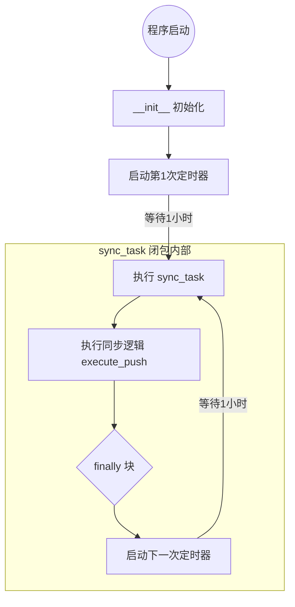

---
# 植树机器人数字孪生模型自动化同步技术方案 V1.2.0

文档状态：正式发布  
发布日期：2026-01-06  
适用范围：植树机器人调度系统、边缘侧嵌入式系统

---
## 1. 背景与目标

在植树机器人全栈开发过程中，机器人的物理结构（URDF/STL）会随迭代频繁变更。当前“人工打包上传”的模式导致 Web 调度端经常出现模型与实物不一致（如机械臂尺寸偏差、底盘构型不同）的“脑裂”现象。
本方案旨在确定一种自动化同步机制，实现“边缘侧修改，云端即时更新”，确保数字孪生的高保真度与一致性。

---
## 2. 方案深度对比分析 (Architecture Decision Record)

针对局域网及弱网环境，我们评估了以下五种技术路径。

### 2.1 候选方案详细定义

- 方案一：Standard ROS Event + HTTP Pull (标准事件触发拉取)
  - 机制：调度服务器监听 ROS 2 全局话题 /parameter_events，筛选 robot_model_hash 变更。
  - 传输：机器人开启轻量级 HTTP 文件服务（python -m http.server），服务器根据 IP 反向下载。
  - 特点：遵循 ROS 标准，但 /parameter_events 数据噪点多，且服务器需直连机器人 IP。
- 方案二：Custom Topic + HTTP Pull (自定义通知拉取)
  - 机制：机器人定义专用话题 /model_update_notify，变更时发布消息。服务器监听该话题。
  - 传输：同方案一，服务器反向 HTTP 下载。
  - 特点：比方案一更轻量（无多余参数噪音），但仍需维护“反向连接”的网络拓扑。
- 方案三：NFS Mount (网络文件系统)
  - 机制：操作系统层面将机器人目录挂载到服务器。
  - 传输：OS 文件 I/O。
  - 特点：极度不推荐。在无线网络下，NFS 断连会导致服务器进程死锁（D 状态），拖垮调度系统。
- 方案四：Robot Push (边缘侧主动推送) —— [推荐]
  - 机制：机器人运行 Watchdog 守护进程，监听文件变更。
  - 传输：机器人主动调用服务器 POST /api/upload 接口上传 ZIP 包。
  - 特点：云原生架构，解耦 ROS，对防火墙友好（无需服务器访问机器人内部）。
- 方案五：Server Polling (服务器轮询)
  - 机制：服务器每隔 N 秒主动查询机器人的 Hash 接口。
  - 传输：若 Hash 变动则下载。
  - 特点：效率最低，产生大量无效流量，且实时性差。

### 2.2 方案综合对比矩阵

下表从触发效率、网络依赖、稳定性等维度进行加权评分（1-5分，5分最优）。

| 维度 | 方案一：ROS Events Pull | 方案二：Custom Topic Pull | 方案三：NFS 挂载 | 方案四：Robot Push (推送) | 方案五：Server Polling |
| --- | --- | --- | --- | --- | --- |
| 实时性 | ⭐⭐⭐⭐ (高) | ⭐⭐⭐⭐⭐ (极高) | ⭐⭐⭐⭐⭐ (即时) | ⭐⭐⭐⭐ (高) | ⭐⭐ (低，依赖轮询间隔) |
| 网络要求 | 需双向互通 | 需双向互通 | 需极高稳定性 | 仅需单向 (Robot->Server) | 需双向互通 |
| 带宽开销 | 中 (事件流大) | 低 | 低 | 低 (按需上传) | 高 (无效心跳包) |
| 稳定性 | ⭐⭐⭐ | ⭐⭐⭐ | ⭐ (极易死锁) | ⭐⭐⭐⭐⭐ (支持断点/重试) | ⭐⭐⭐ |
| 耦合度 | 高 (依赖 ROS) | 中 (依赖 ROS) | 极高 (OS 级耦合) | 低 (仅依赖 HTTP API) | 中 |
| 开发成本 | 中 | 中 | 低 | 中 (需写 Watchdog) | 低 |
| 弱网适应性 | 差 | 差 | 极差 | 强 (可排队/重试) | 差 |
| 总评推荐 | 备选 | 备选 | 淘汰 | ✅ 最终入选 | 淘汰 |

### 2.3 决策结论

经过对比，方案四 (Robot Push) 胜出。
- 理由：植树机器人作业环境可能存在 WiFi 信号波动。方案四采用短连接（HTTP POST）且由机器人主动发起，具备天然的“断线重连”与“失败重试”能力，且不需要调度服务器知道机器人的 IP 地址，架构最为松耦合。

---
## 3. 最终实施技术规范 (Technical Specification)

基于 方案四 (Robot Push)，制定 V1.1.0 实施标准。

### 3.1 总体架构图

以下架构图展示了从边缘侧文件监听到 Web 端可视化更新的完整数据流向：
代码段

```mermaid
graph LR
    subgraph "Robot Edge (植树机器人)"
        direction TB
        FS[文件系统 (URDF/STL)] -->|File Change| Inotify[Inotify Hook]
        Inotify -->|Trigger| Watcher[ModelWatcher Service]
        Watcher -->|Debounce & Hash| ZIP[ZIP Package]
    end

    subgraph "Scheduling Server (调度后端)"
        direction TB
        API[API: /upload] -->|Raw Data| Baker[GLB 烘焙管线]
        Baker -->|Store| MinIO[(MinIO Object Storage)]
        Baker -->|Notify| WS[WebSocket Service]
    end

    subgraph "Web Frontend (监控端)"
        direction TB
        WS -->|Event: MODEL_UPDATED| React[React App]
        MinIO -->|Download GLB| React
        ROS[ROS 2 TF Stream] -->|Drive Motion| React
    end

    ZIP -->|HTTP POST| API
```

[图片]

架构说明：
1. Robot Edge: 负责监听物理文件变更，执行防抖与打包，主动推送至服务端。
2. Scheduling Server: 充当处理中心，接收原始工程文件，转换为轻量级 GLB，并广播更新事件。
3. Web Frontend: 响应广播事件，动态替换场景模型，并结合实时 TF 数据驱动显示。

### 3.2 边缘侧实施规范 (Robot Edge)

在机器人嵌入式工控机中部署 ModelWatcher 服务。
- 监听范围：
  - URDF 路径: src/tree_robot_description/urdf/*.urdf
  - Mesh 路径: src/tree_robot_description/meshes/*.stl
- 核心逻辑 (Python)：
  1. Inotify 监听：使用 watchdog 库监控上述目录。
  2. 防抖 (Debounce)：设置 2000ms 的静默窗口。防止文件写入过程中的中间状态触发上传。
  3. 指纹 (Fingerprint)：计算 md5(urdf_content + all_stl_contents)。若指纹与上一次相同，不触发上传。
  4. 打包：生成 model_autogen.zip。
  5. 推送：POST http://{SERVER_IP}:8000/api/model/upload。
  6. **(New) 失败重试**：网络异常时，启用指数退避策略 (2s, 4s, 8s...) 自动重传。
  7. **(New) 定期同步**：每小时强制进行一次一致性检查，防止漏传。

边缘侧代码片段 (watcher.py)：
Python

```python
import time
import requests
import shutil
from threading import Timer
from watchdog.events import FileSystemEventHandler

class RobotModelPusher(FileSystemEventHandler):
    def __init__(self, api_url):
        self.api_url = api_url
        self.max_retries = 5  # 最大重试次数
        # ... 初始化逻辑 ...
        self._start_periodic_sync(interval=3600) # 启动每小时同步

    def execute_push(self):
        # ... 打包 ZIP ...
        self._upload_with_retry(zip_filename)

    def _upload_with_retry(self, filename):
        for attempt in range(self.max_retries):
            try:
                requests.post(self.api_url, ...)
                return # 成功
            except Exception:
                delay = 2 ** attempt
                time.sleep(delay) # 指数退避
```

### 3.3 服务端实施规范 (Scheduling Server)

- 接口：POST /api/model/upload
- 处理流：
  1. 接收：识别 version 字段以 auto- 开头。
  2. 清洗：解压 ZIP，解析 URDF。
  3. 映射：将 URDF 中的 package:// 路径动态映射到解压后的临时目录。
  4. 烘焙：调用 trimesh 将颜色烘焙入顶点，生成 GLB。
  5. 通知：通过 WebSocket 向前端广播 { event: "MODEL_UPDATED", url: "..." }。

### 3.4 Web 端实施规范 (Frontend)

- 热更新策略：
  - 收到 WebSocket 通知后，不要立即刷新页面。
  - 在后台通过 Three.js 的 GLTFLoader 预加载新模型。
  - 加载完成后，执行 scene.remove(old_model) 和 scene.add(new_model)。
  - 关键：重新绑定当前的 TF 数据到新模型的节点上，确保运动状态不丢失。

### 3.5 断点续传技术分析 (Analysis of Resumable Upload)

在生产环境中，是否引入“断点续传”需根据文件体积与网络状况综合决策。基于本项目的场景（植树机器人），我们遵循 **“文件越大 + 网速越慢/越不稳 = 必须用断点续传”** 的原则。

#### 3.5.1 核心场景评估矩阵

| 场景 | 是否需要断点续传 | 建议方案 |
| --- | --- | --- |
| 场景 A：仅同步 URDF 代码和小型 STL | 不需要 | 保持现状：模型压缩包通常 5MB-20MB，普通 HTTP POST 1-2 秒完成；引入断点续传会增加复杂度。 |
| 场景 B：包含高清纹理的 GLB/DAE（>50MB） | 建议引入 | 若模型含 4K 贴图导致体积增大，建议改用 MinIO SDK 的 fput_object（自带分片上传封装），避免手写切片逻辑。 |
| 场景 C：机器人户外实地回传日志/数据 | 必须引入 | 户外 4G/5G 弱网场景下，大包（如 Rosbag）上传极易中断；必须使用断点续传保证可完成。 |

#### 3.5.2 技术原理与优势
1. **应对网络抖动**：将大文件切分为小块（如 5MB/块）。若网络中断，只需重传失败的那一块，而非重头开始。
2. **规避服务器超时**：Nginx 等网关通常有 60s 超时限制。分片上传将一个长连接拆解为多个短连接，有效绕过此限制。
3. **用户交互支持**：支持暂停/恢复操作，适合大文件下载场景。

**结论**：当前 V1.2.0 版本暂不引入断点续传，仅通过 **指数退避重试 (Exponential Backoff)** 机制保障 50MB 以下文件的传输稳定性。若未来模型体积显著增长，将平滑升级至 MinIO 分片上传方案。

### 3.6 定期同步机制设计模式分析

为了实现高鲁棒性的定期同步（Periodic Sync），我们采用了基于 **自调度任务 (Self-Scheduling Task)** 的设计模式。该模式结合了 **Command Pattern (命令模式)** 的思想，通过递归式的定时器注册，确保了任务执行的串行性与容错性。

#### 3.6.1 执行时序图解

该机制并非传统的 `while True` 循环，而是通过“接力”方式维持生命周期：



#### 3.6.2 设计优势
1. **鲁棒性 (Robustness)**：利用 `try...finally` 结构，确保即使业务逻辑（如网络请求）发生未捕获异常，下一次调度的注册（`NextTimer`）依然会执行。这避免了因单次故障导致整个同步链条断裂。
2. **防堆积 (Anti-Stacking)**：不同于固定频率调度（Fixed Rate），本方案是在**当前任务执行完毕后**才开始计算下一次的等待时间。如果某次同步耗时过长，下一次调度会自动顺延，天然避免了任务重叠。
3. **资源效率**: 纯异步实现，在等待期间不占用任何线程阻塞资源。

---
## 4. 异常处理机制

1. 网络中断：
  - 若机器人上传超时，ModelWatcher 记录错误日志，并将在下一次文件变动时再次尝试（或增加定时重试机制）。
2. 文件不完整：
  - 服务端校验 ZIP 文件的 CRC32，若校验失败，返回 HTTP 400，拒绝处理。
3. 版本冲突：
  - 采用时间戳 + 哈希作为版本号（如 auto-1736150000-a1b2c3），确保版本唯一且按时间排序。

---
## 5. 部署清单

- 机器人端：
  - 依赖：pip install watchdog requests
  - 服务：配置 Systemd 开机自启 model-watcher.service。
- 服务端：
  - 开放端口：8000 (API), 9000 (MinIO)。
  - 配置：允许来自机器人 IP 段的 POST 请求。
